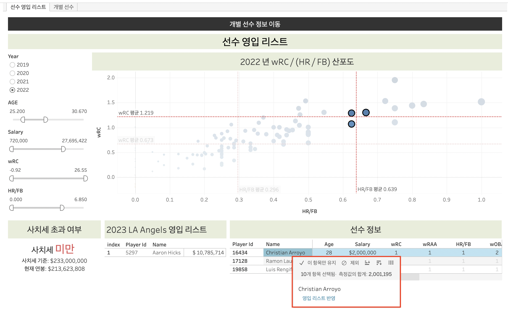
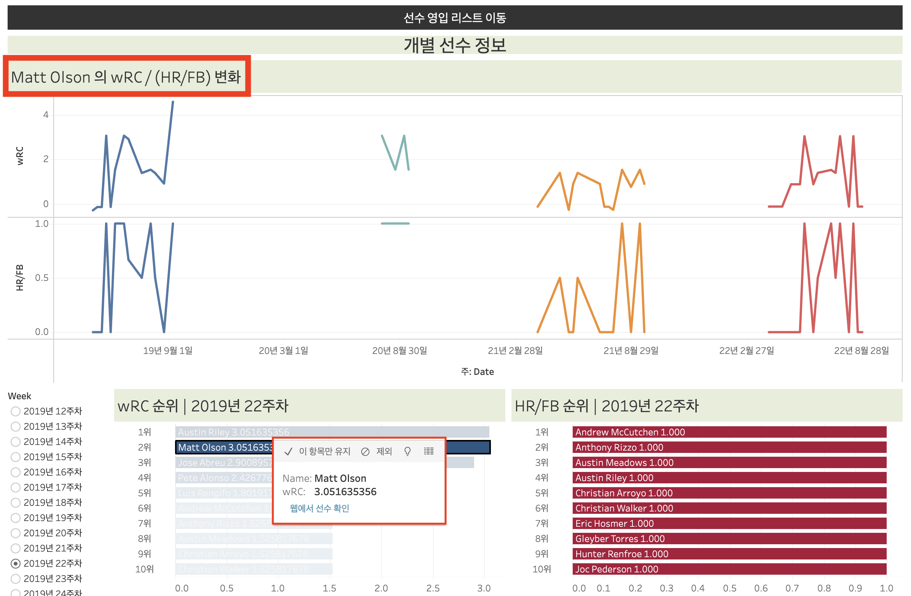
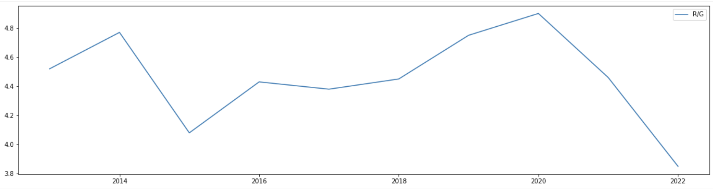
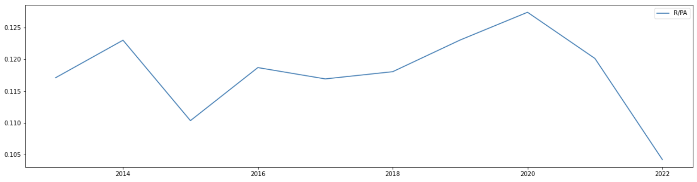
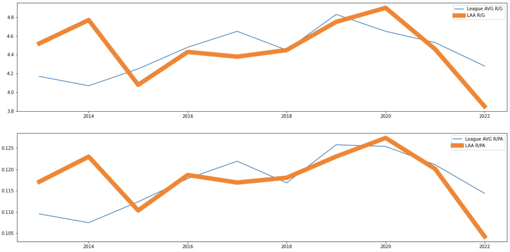
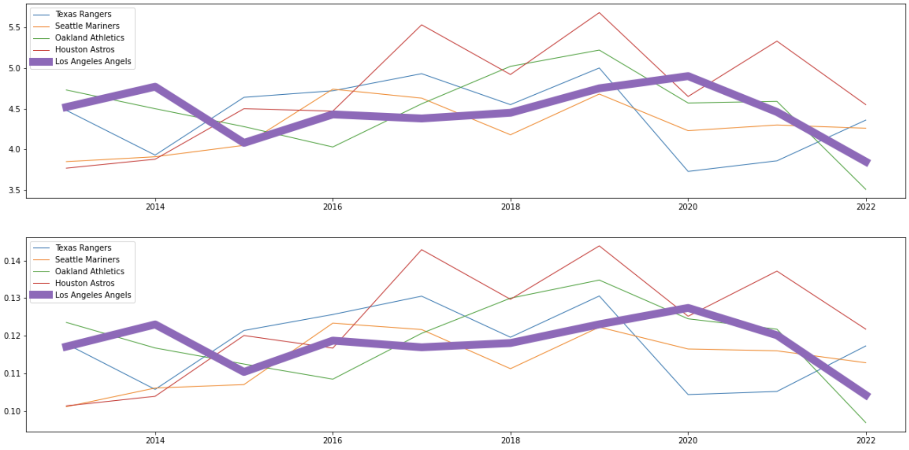

## MLB Project - LA Angels의 득점력 높이기

### 1. Tableau 선수 영입 대시보드
2개의 대시보드 상단에 이동의 편의를 위해 **대시보드 탐색**을 만들었습니다.

영입 시에 고려해야 하는 요소들을 반영한 가상의 영입 리스트를 제작했습니다.

데이터 분석을 통해 득점력에 영향을 많이 미치는 2가지 주요 공격 지표(wRC, HR/FB)를 찾았습니다. Year, 선수 영입 시에 고려되는 중요 요인인 나이, 연봉, 그리고 주요 공격 지표를 조절하며 변화하는 산포도를 나타냈습니다. 년도별 평균을 반영해 선수들의 성적과 쉽게 비교할 수 있도록 나타냈습니다.

산포도 영역에서 특정 점 또는 영역을 선택하면, 하단의 선수 정보 시트에 자동으로 반영됩니다. 해당 시트에는 산포도에서 선택한 선수의 중요 지표들을 자세하게 살펴볼 수 있습니다.

그리고, 영입을 결정했다면 선수 정보에서 선수를 클릭해서 **영입 리스트 반영**을 선택하면 왼쪽에 있는 영입 리스트에 올라갑니다. 현재 팀의 연봉, 추가되는 선수들의 연봉을 합산해 사치세 초과 / 미만을 알려주는 시트를 같이 제작했습니다.

상단의 **개별 선수 정보 이동**을 클릭하면, 다른 대시보드로 이동합니다.

좌측의 **Week 매개변수**를 통해 시기별 주요 특징(ex. wRC, HR/FB)의 1 - 10위의 선수들을 확인할 수 있습니다. 또한 순위에 있는 특정 선수를 클릭하면, 상단의 워크시트에서 해당 선수의 2019 - 2022년까지 주차별 특징 변화를 확인할 수 있습니다. 선택을 통해 **웹에서 선수 확인**을 클릭하면, 구글 검색 결과를 같이 제공합니다.

상단의 **선수 영입 리스트 이동**을 클릭하면, 다른 대시보드로 이동합니다.

가상의 [LA Angels의 선수 영입을 위한 Tableau 대시보드](https://public.tableau.com/views/MLB_16789615109590/sheet5?:language=ko-KR&publish=yes&:display_count=n&:origin=viz_share_link)는 링크를 클릭하면, 확인할 수 있습니다.

### 2. MLB Project 소개
#### 2.1 결론
미국 프로야구 팀 LAA(Los Angeles Angels)의 낮은 득점력을 높이기 위한 해결 방안으로 다음을 제시합니다
* vs RHP (우타자 상대)
* Through 2-1 Through 0-1 Through 2-0 Through 1-1 Through 1-0 (볼 카운트)
* Flyballs (뜬 공)
* Runners On (주자가 있는 상황)
* Hard (강한 타구)

상황에서 'wRC', 'wRAA', 'HR/FB', 'wOBA', 'wRC+’가 높은 선수를 영입해야 합니다.

#### 2.2 평가 지표 및 기준
야구팀의 득점력에 대한 지표로 경기당 득점(R/G; Runs Per Game), 타석당 득점(R/PA; Runs Pers Plate Apperance)을 선택했습니다.
* 경기당 득점은 얼마나 많은 득점을 하는지 알려주지만, 팀의 효율적인 공격을 나타내지 못 합니다.
* 타석당 득점은 효율적인 공격을 하고 있는지 알려줍니다. 하지만, 타석당 득점이 높은 상황은 일반적으로 자주 발생하는 상황이 아닙니다.

득점력과 관련된 2개의 지표는 한계점을 갖고 있기 때문에 득점의 양을 나타내는 R/G와 득점의 질을 나타내는 R/PA를 합친 득점력 지표를 새로 만들어서 LA Angeles의 득점력을 분석합니다.

#### 2.3 MLB Project
##### 2.3.1 문제 및 목적 정의
* 문제 - 미국 프로야구(Major League Baseball)팀인 Los Angeles Angels의 득점력이 낮다.
* 목적 - 팀의 득점력을 높이기 위함이다.

##### 2.3.2 LA Angels의 현황

위의 그림은 LA Angels의 최근 10년간 득점력 관련 지표인 경기당 득점, 타석당 득점입니다. 2015 - 2020 년까지는 득점의 양(경기당 득점)과 질(타석당 득점)에서 증가하는 추세였습니다. 하지만, 최근 2년 동안은 득점의 양과 질에서 모두 하락하는 추세입니다. 작년 득점과 관련된 지표는 최근 10년 중에서 가장 나쁜 성적입니다.

##### 2.3.3 LA Angels의 득점력 평가
득점력 평가를 위한 비교 대상은 리그 전체, LA Angels와 같은 소속 팀들을 선정했습니다.

**리그 전체**
- 15년 이후에는 리그 평균과 비슷한 수준의 득점력이었다. 
- 리그 전체적으로도 20년부터는 모든 팀의 득점력이 떨어지는 추세였다. 하지만, LAA는 리그 평균의 득점보다 더 큰 낙폭을 기록하고 있다.

**LA Angles와 같은 소속에 속한 팀**
- 같은 소속 지구의 팀과는 정규 리그 우승을 두고 경쟁하기 때문에 더욱 중요하다. 
- 경쟁팀과 비교하면, LAA의 득점력은 대부분 하위를 기록하고 있다. 2020년에는 득점의 양과 질에서 모두 1위였지만, 이후에는 다시 하락세로 기록하고 있다.

**평가**
* 최근 2년간 리그 평균과 비교하면, 득점력이 부족하다.
* 최근 2년간 같은 지구에 속한 경쟁팀과 비교하면, 득점력이 부족하다. 특히, 정규 리그 우승을 위해서는 경쟁팀들보다 득점력이 떨어지면 안 된다.
* 그래서 팀의 득점력을 높일 수 있는 적절한 선수 영입이 필요하다.

##### 2.3.4 선수 영입을 위한 변수 및 주요 지표 탐색
LA Angels의 득점력 하락을 해결하기 위해서는 적절한 선수 영입이 필요합니다.
* 선수 영입 조건을 파악하기 위해 득점력에 큰 영향을 미치는 상황들을 분석합니다.
* 그리고 해당 상황 속에서 어떤 지표가 득점력에 큰 영향을 미치는지 판단합니다.
* 상황, 지표를 분석해 팀의 득점력을 높일 수 있는 선수 영입 조건으로 판단합니다.

##### 2.3.5 결론
미국 프로야구 팀은 LAA(Los Angeles Angels)의 낮은 득점력을 높이기 위해서

* vs RHP (우타자 상대)
* Through 2-1 Through 0-1 Through 2-0 Through 1-1 Through 1-0 (볼 카운트)
* Flyballs (뜬 공)
* Runners On (주자가 있는 상황)
* Hard (강한 타구)

상황에서 'wRC', 'wRAA', 'HR/FB', 'wOBA', 'wRC+’가 높은 선수를 영입해야 합니다.
